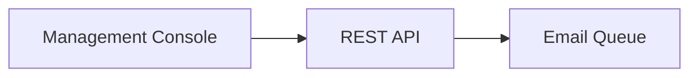

# Write-up format

Each project is a folder, `src/content/projects/<slug>/`:

| File            | Purpose                                                                      |
| --------------- | ---------------------------------------------------------------------------- |
| `index.md`      | Frontmatter plus the write-up. Required. Adding the folder adds the project. |
| `case-study.md` | Optional first-person case study (no frontmatter, no `##` sections).         |
| `brief.md`      | The questionnaire answers. Ignored by the build.                             |

`<slug>` must equal the project name lowercased, with every run of non-alphanumerics
replaced by `-` (`Third-Party Services Framework` → `third-party-services-framework`). It
is also the URL.

The build (`plugins/project-content.ts`) rejects anything outside this format with a
`file:line` error. That's deliberate: the format is the whole vocabulary.

## Frontmatter

```yaml
---
name: Google Vault Collector
type: Work # Work | Personal
startYear: 2024
endYear: 2024 # or: present
description: One sentence, ending in a period, shown under the title and on the project card.
tech: [Java, React, OIDC] # keys of techType in src/types/TechTypes.ts, most important first
url: https://example.com # optional: the live project
role: Lead developer # optional: shown in the meta row
related: [third-party-services-framework] # optional: slugs, linked above the footer
draft: true # optional: shown in dev, hidden in production
---
```

## Body

The body is a sequence of `## Section` headings, each followed by its content. `###`
sub-headings divide a section and appear nested in the table of contents. They go directly in a section, never inside a list or block. There are no
other heading levels. Nothing may come before the first `##`.

| Write                                         | Renders as              | Use for                                    |
| --------------------------------------------- | ----------------------- | ------------------------------------------ |
| Plain paragraphs                              | Body text               | Most of the page                           |
| `**bold**`                                    | Semibold                | Naming a concept the first time it appears |
| `*italic*`                                    | Italic                  | Rarely                                     |
| `` `Set Vault Matter` ``                      | Inline code             | Names a user sees: operations, options     |
| `- item`                                      | Bulleted list           | Short parallel items                       |
| `1. item`                                     | Numbered list           | Ordered items that aren't a process        |
| `[text](/projects/<slug>)`                    | Link to another project | Cross-references (checked at build)        |
| `[text](https://...)`                         | External link (new tab) | Rarely                                     |
| `[text](mailto:...)`, or a bare email address | Mail link               | Contact details, rarely                    |
| GFM table                                     | Table                   | Relationships ("Component / Relations")    |

### Blocks

**`:::terms`**: a definition list. Use it for the component lists that anchor a section.
Every item must read `**Term**: definition`.

```md
:::terms

- **Data Layer**: Generic database models and tables that reference abstract types.
- **API Layer**: Generic API resources that operate consistently using abstract types.

:::
```

**`:::steps`**: a numbered sequence joined by a rail. Use it for processes and lifecycles
where order is the point. Contains exactly one numbered list.

```md
:::steps

1. **Activation**: Custodians receive Hold Notices.
2. **Release**: When the hold ends, custodians receive Release Notices.

:::
```

**`:::info`** and **`:::note`**: asides. `info` is for a fact that qualifies the text
around it ("optional", "read-only", "never exposed"). `note` is for a prerequisite or
clarification the reader might miss. An optional title goes in brackets: `:::info[Title]`.
Never put two in a row.

```md
:::info

Unlike regular data repositories, in-place datasets are strictly read-only.

:::
```

**Diagrams**: a fenced `mermaid` block. Text after `mermaid` is the caption. Use one
high-level diagram where the connections between components are the point. Keep it to
components and arrows, at the level of the `:::terms` list.

````md

````

**`::redacted{lines=N}`**: a placeholder bar for detail that's deliberately withheld
(security-sensitive or proprietary), so the surrounding text still reads as complete.
Allowed inside a list item.

**Code blocks** (fenced, with a language): allowed, but see the style guide. They're for
when the _shape_ of an interface is the point.

Leave a blank line after each opening `:::` line and before each closing `:::`. Prettier
keeps that layout intact.

Not allowed: `#` and `####`+ headings, raw HTML, images, block quotes, footnotes, task
lists (`- [ ]`), relative links, and any `:::` block not listed above.
